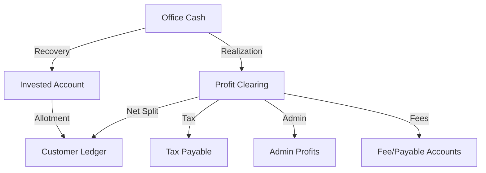

# Finpro Accounting Architecture Guide

This document outlines the relationship between Office (System) accounts and Customer/Investor accounts, including the Debit/Credit rules for all major transaction types.

## 1. Core Principles
- **Double Entry System**: Every transaction involves at least one Debit and one Credit.
- **Internal Fund Blocking (Lien)**: IPO fund blocking is an internal state (updates `held_balance`). It **does not** create a Ledger Transaction.
- **Ledger Types**:
    - **Asset (Office Cash, Invested Account)**: Increases on Debit (+), Decreases on Credit (-).
    - **Equity (Core Capital Account)**: Increases on Credit (+), Decreases on Debit (-).
    - **Liability (Customer Ledger, Payables)**: Increases on Credit (+), Decreases on Debit (-).
    - **Income (Fee Income)**: Increases on Credit (+).

---

## 2. Standardized System Accounts

| Account Name | Account Type | Role |
| :--- | :--- | :--- |
| **Office Cash** | `OFFICE` | Company's liquid cash pool. |
| **Core Capital Account** | `CORE_CAPITAL` | Company's initial equity. |
| **Invested Account** | `INVESTED_ACCOUNT` | Asset account representing the value of scrips held in portfolios. |
| **Profit Clearing** | `SUSPENSE` | Temporary account used during the two-phase settlement of share sells. |
| **Tax Payable (CGT)** | `TAX_PAYABLE` | Liability to the government. |
| **Broker Commission Payable**| `TAX_PAYABLE` | Liability to the broker (includes NEPSE/SEBON fees). |
| **Demat AMC Payable** | `TAX_PAYABLE` | Liability for Demat maintenance charges. |
| **Subscription Fee Income** | `FEE_INCOME` | Company income from annual subscriptions. |
| **Admin Profits** | `PROFIT_ACCOUNT`| Company's 60% share of realized profits. |

---

## 3. Standard Transaction Flows

### 3.1 IPO Allotment (Converting Cash to Investment)
Triggered when shares are allotted to a customer.
1. **Unhold Funds**: Internal release of `held_balance`.
2. **Standard Entry**:
    - **Debit**: `Customer Ledger` (-)
    - **Credit**: `Invested Account` (+)
    - **Result**: Customer's account is debited, and the company's "Invested" asset increases.

### 3.2 Share Sell Settlement (Two-Phase Distribution)
When scrips are sold, a two-phase process ensures granular tracking.

**Phase 1: Realization & Principal Recovery**
- **Debit**: `Office Cash` (+) [Gross Price]
- **Credit**: `Broker Commission Payable` (+) [Broker Fees]
- **Credit**: `Invested Account` (-) [Principal Cost]
- **Credit**: `Profit Clearing` (+) [Gross Profit + Tax]

**Phase 2: Profit Distribution**
- **Debit**: `Profit Clearing` (-) [Gross Gain]
- **Credit**: `Tax Payable (CGT)` (+)
- **Credit**: `Admin Profits` (+) [60% of Net Profit]
- **Credit**: `Subscription Fee Income` (+) [If collected]
- **Credit**: `Demat AMC Payable` (+) [If collected]
- **Credit**: `Customer Ledger` (+) [40% of Net Profit - Deductions]

---

## 4. Relationship Diagram

## 5. Verification Checklist
- [x] All system accounts are registered in `ledger_accounts` and `system_accounts`.
- [x] Every transaction updates the `balance` field in `ledger_accounts` for both parties.
- [x] `CustomerBankAccount` balance reflects the `actual_balance` of the `Customer Ledger`.
- [x] `held_balance` in `CustomerBankAccount` is synced via `AccountLien` records.
